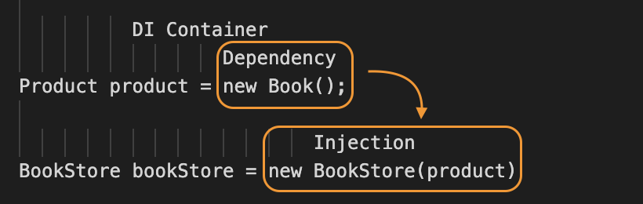

<br/>
<br/>

# 의존성 주입(DI | Dependency Injection)

Spring 프레임워크에서는 3가지 프로그래밍 모델을 지원하고 있는데, 그 중 하나가 오늘 공부해 볼 <span style="color: #0550ae; font-weight: bold">의존성 주입(DI | Dependency Injection)</span>이다.  

<br/>
## 의존성 주입(DI | Dependency Injection)의 특징
> 
1. 클래스 모델이나 코드에는 런타임 시점의 의존관계가 드러나지 않는다.  
  그러기 위해서는 인터페이스만 의존하고 있어야 한다.
2. 런타임 시점의 의존관계는 컨테이너나 팩토리 같은 제3의 존재가 결정한다.
3. 의존관계는 사용할 오브젝트에 대한 레퍼런스를 외부에서 제공(주입)해줌으로써 만들어진다.  
-- 이일민, 토비의 스프링 3.1, 에이콘(2012), p114  

<span style="color: #0550ae;">객체 간의 관계를 외부에서 결정할 수 있도록 해주는 디자인 패턴</span>이며, 이를 통해 코드의 결합도를 낮추고 유연성을 높일 수 있다. 객체의 의존 관계를 Interface를 통해 정의함으로써 런타임 시점에 다양한 구현체를 주입할 수 있게 되고, 이러한 특징은 특히 대규모 애플리케이션에서 유지보수성과 테스트 용이성을 향상시킬 수 있다.
  

<br/>

> 참고 | 구현체란?  
특정 인터페이스나 추상 클래스를 기반으로 실제 기능을 구현한 클래스. 이를 통해 정의된 메서드와 속성을 구체적으로 어떻게 동작하게 할지를 명시하게 되며, 프로그램에서 사용할 수 있는 객체를 생성할 수 있다.  

<br/>
* * *
<br/>

## 의존성이란?
한 객체가 다른 객체를 사용할 때 성립하는 관계를 의미하는데, <span style="color: #0550ae;">'A라는 객체가 B객체를 사용할 때 의존성이 있다'</span>라고 표현한다. 
> 의존대상 B가 변하면, 그것이 A에 영향을 미친다.  
-- 이일민, 토비의 스프링 3.1, 에이콘(2012), p113

이 의존성은 객체의 생명주기와 밀접한 연관이 있으며, 의존성이 강할수록 두 객체 간의 결합도는 높아진다.

```java
public class BookStore {
    private Book book;
}
```
위 예시에서 `BookStore`는 `Book`을 직접적으로 의존하기 때문에 불필요한 결합도를 발생시켜 유연성을 저하시킨다.

또한, <span style="color: #0550ae;">두 객체 간의 관계, 즉 의존성을 맺어주는 것을 의존성 주입</span>이라고 하며 대표적인 종류로는  
- **생성자 주입**
- 필드 주입
- 수정자 주입
등이 있다.  


하지만 **Spring4 부터는 생성자 주입을 권장**하고 있으니 참고하자.  

<br/>
* * *
<br/>

## 의존성 주입(DI | Dependency Injection)이 필요한 이유
```java
public class BookStore {
    private Book book;

    public BookStore() {
        this.book = new Book();
    }
}
```

위 예시에서는

### 문제점 1: 두 클래스의 결합 강도 ↑
`BookStore` 클래스는 내부에서 `Book` 객체를 직접 생성하고 있다. 이로 인해 `BookStore`와 `Book` 클래스 간의 결합 강도가 높아지고, 결합 강도가 높다는 것은 두 클래스가 서로 강하게 의존하고 있다는 뜻으로 다음과 같은 단점이 있다:
  - 유연성 부족: `Book` 클래스의 변경이 `BookStore` 클래스에 직접적인 영향을 미친다. 예를 들어, `Book` 클래스의 생성자가 변경되면 `BookStore` 클래스도 수정해야 한다.
  - 테스트 어려움: `BookStore`를 단위 테스트할 때, `Book` 객체의 상태와 동작에 의존하게 되어 테스트가 복잡해질 수 있다.

### 문제점 2: 객체들 간 관계가 아닌 클래스 간 관계
현재 `BookStore` 클래스는 `Book` 클래스에 대한 직접적인 의존성을 가지고 있다. 이는 객체들 간의 관계를 설정하는 대신 클래스 간의 관계를 강하게 만든다. 이로 인해 발생하는 문제는 다음과 같다:
  - 재사용성 저하: 다른 종류의 책을 저장하는 `BookStore`가 필요할 경우, `Book` 클래스를 변경하거나 새로운 클래스를 만들어야 할 수 있다. 이는 코드 중복과 유지보수의 어려움을 초래한다.
  - 다형성 부족: `Book` 클래스의 서브클래스를 사용할 수 있는 유연성이 없다. 예를 들어, `EBook`이나 `AudioBook` 같은 다양한 책 유형을 지원하고자 할 때, 코드 변경이 필요하다.
<br/>
결국 위와 같은 문제가 발생하는 이유는, `BookStore`에서 어떤 책을 판매할 것인가에 대한 **관심사가 분리되지 않았기 때문**이라고 할 수 있고, 
이러한 문제는 의존성 주입(DI | Dependency Injection)을 적용하여 해결할 수 있다.

<br/>
* * *
<br/>

## 의존성 주입(DI | Dependency Injection)을 통한 문제 해결
위와 같은 문제를 해결하기 위해서 우선적으로 다형성을 필요로 한다. `Book`, `Magazine` 등 여러 제품을 하나로 표현하기 위해 `Books`라는 Interface가 필요하다.

```java
public interface Books {
    // 책에 대한 메서드 정의
}

public class Book implements Books {
    // Book 클래스의 구현
}
```

이제 `BookStore`와 `Book`이 강하게 결합된 부분을 제거하여 `BookStore`가 구체 클래스에 의존하지 않도록 해줘야 한다. 이를 위해 외부에서 상품을 주입받아야 한다.

```java
public class BookStore {
    private Books books;

    public BookStore(Books books) {
        this.books = books;
    }
}
```

이럴 때를 위해 Spring에서는 **DI Container**를 지원하는데, <span style="color: #0550ae;">`BookStore`에서 `Books` 객체를 주입하기 위해 애플리케이션 실행 시점에서 필요한 객체(즉, Bean)를 생성하고, 의존성이 있는 두 객체를 연결하기 위해 한 객체를 다른 객체로 주입시켜야 한다.</span>

그러니까 다음과 같이 `Book`이라는 객체를 만들고, 그 객체를 `BookStore`로 주입시켜주는 역할을 위해 DI Container가 필요하다.  

```java
public class BeanFactory {
    public void bookStore() {
        // Bean의 생성
        Product book = new Book();

        // 의존성 주입
        BookStore bookStore = new BookStore(book);
    }
}
```

## DI Container란?
**특정 위치부터 클래스를 탐색하여 객체를 만들고, 객체들 간의 관계까지 설정하는 것**을 말한다. 그리고 제어의 역전(IoC, Inversion of Control)이라고 불리기도 한다. 어떠한 객체를 사용할 것인가에 대한 책임은 프레임워크에게 넘기고 자신은 수동적으로 주입되는 객체만을 받아 사용하기 때문이다.  

<br/>
* * *
<br/>

## 의존성 주입(DI | Dependency Injection) 정리
의존성 주입(Dependency Injection, DI)은 객체 간의 의존성을 관리하는 디자인 패턴이다. 이 패턴의 주요 목적은 객체가 필요한 의존성을 외부에서 주입받도록 하여 결합도를 낮추고, 코드의 유연성과 테스트 용이성을 높이는 것이다.  

### 주요 개념
- **의존성**: 한 객체가 다른 객체를 필요로 할 때, 이를 의존성이라고 한다.
- **주입**: 의존성을 객체 외부에서 제공하는 과정이다.

### 방법
- <span style="color: #0550ae; font-weight: bold">생성자 주입: 의존성을 생성자의 매개변수로 전달한다.</span>
- **세터 주입**: 세터 메서드를 통해 의존성을 주입한다.
- **인터페이스 주입**: 특정 인터페이스를 통해 의존성을 주입하는 방식이다.

### 장점
- **결합도 감소**: 객체 간의 의존성을 줄여 더 유연한 설계를 가능하게 한다.
- **테스트 용이성**: Mock 객체를 사용하여 단위 테스트를 쉽게 수행할 수 있다.
- **유지보수성 향상**: 코드 변경 시 의존성 관리가 용이해 유지보수가 쉬워진다.  

<br/>
<br/>
<br/>
* * *
<br/>
<br/>
<br/>

> **Reference**  
1. <a href="https://mangkyu.tistory.com/150" style="text-decoration: none; color: #757575;">Spring] 의존성 주입(Dependency Injection, DI)이란? 및 Spring이 의존성 주입을 지원하는 이유</a>
2. <a href="https://tecoble.techcourse.co.kr/post/2021-04-27-dependency-injection/" style="text-decoration-line: none; color: #757575;"> 의존관계 주입(Dependency Injection) 쉽게 이해하기 </a>
