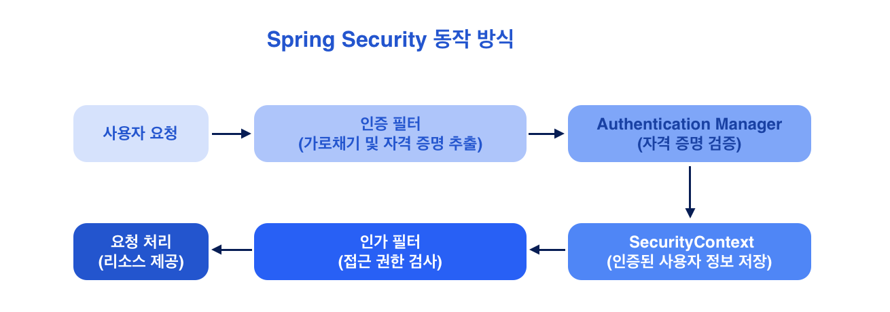

<br/>
<br/>

# 스프링 시큐리티란? 
스프링 시큐리티(Spring Security)는 스프링 애플리케이션에 강력하고 유연한 보안 기능을 추가하기 위한 프레임워크다. 이 프레임워크는 주로 인증(Authentication)과 인가(Authorization)를 관리하며, 애플리케이션의 보안을 강화하는 역할을 한다.  

<br/>

## 1. 인증 (Authentication)
**인증**은 사용자가 누구인지 확인하는 과정. 사용자가 제공한 자격 증명(예: 사용자 이름과 비밀번호)을 기반으로 해당 사용자가 시스템에 접근할 수 있는지를 검증한다.  

### 인증 방법  
- **폼 기반 인증**: 사용자가 로그인 폼을 통해 자격 증명을 제출하는 방식
- **Basic 인증**: HTTP 요청 헤더를 통해 자격 증명을 전송하는 방식
- **OAuth2 / OpenID Connect**: 소셜 로그인이나 타사 인증 서비스를 이용하는 방식

<br/>

## 2. 인가 (Authorization)
**인가**는 인증된 사용자가 시스템에서 어떤 자원에 접근할 수 있는지를 결정하는 과정. 사용자가 특정 작업(예: 특정 URL에 대한 접근, 특정 API 호출 등)을 수행할 수 있는 권한이 있는지를 검사한다.
- **역할 기반 인가**: 사용자의 역할(예: ADMIN, USER)에 따라 특정 자원에 대한 접근을 허용하거나 차단
- **권한 기반 인가**: 특정 권한(예: READ_PRIVILEGES, WRITE_PRIVILEGES)을 기준으로 접근을 제어  

스프링 시큐리티에서는 URL 패턴, 메서드 호출, 특정 도메인 객체에 대한 접근을 제어할 수 있는 다양한 방법을 제공한다.  

<br/>

## 3. 주요 기능
- **CSRF 보호**: Cross-Site Request Forgery(CSRF) 공격으로부터 보호
- **세션 관리**: 세션을 관리하고, 세션 고정 공격을 방지
- **비밀번호 암호화**: 사용자의 비밀번호를 안전하게 저장하고 관리
- **LDAP, JDBC 인증**: LDAP 서버 또는 데이터베이스를 통해 사용자 인증을 지원
- **메서드 보안**: 서비스 계층에서 메서드 호출에 대한 접근 제어를 할 수 있음  

<br/>

## 4. 스프링 시큐리티 설정 예시
스프링 시큐리티를 설정하는 기본적인 방법은 `WebSecurityConfigurerAdapter`를 확장하여 필요한 보안 구성을 정의하는 것입니다. 최근 버전에서는 `SecurityFilterChain`을 사용하여 더 유연하게 설정할 수 있다.  
```java
import org.springframework.context.annotation.Bean;
import org.springframework.context.annotation.Configuration;
import org.springframework.security.config.annotation.web.builders.HttpSecurity;
import org.springframework.security.config.annotation.web.configuration.EnableWebSecurity;
import org.springframework.security.web.SecurityFilterChain;

@Configuration // Configuration class로 등록하는 어노테이션 
@EnableWebSecurity 
public class SecurityConfig {

    @Bean
    public SecurityFilterChain filterChain(HttpSecurity http) throws Exception {
        // HTTP 요청에 대한 보안 설정
        http
            .authorizeHttpRequests((auth) -> auth
                .requestMatchers("/", "/login").permitAll() // 모든 사용자가 접근 가능 
                .requestMatchers("/admin").hasRole("ADMIN") // ADMIN 역할이 있는 경우 접근 가능 
                .requestMatchers("/my/**").hasAnyRole("ADMIN", "USER") // ADMIN 또는 USER 역할이 있는 경우 접근 가능
                .anyRequest().authenticated() // 위에서 처리되지 않은 요청은 인증된 사용자만 접근 가능
            );

        // 로그인 설정
        http 
            .formLogin((auth) -> auth
                .loginPage("/login") // 커스텀 로그인 페이지
                .loginProcessingUrl("/loginProc") // 로그인 요청 처리 URL
                .permitAll() // 모든 사용자에게 로그인 페이지 접근 허용
            );

        // CSRF 보호 비활성화
        http    
            .csrf((auth) -> auth.disable());

        return http.build(); // 설정된 SecurityFilterChain 반환
    }
}
```

<br/>

## 5. 동작 방식
스프링 시큐리티는 HTTP 요청을 처리하는 필터 체인을 통해 인증과 인가를 실행한다.
  
<br/>

1. **사용자 요청**: 사용자가 요청을 보냄
2. **인증 필터**: 요청이 `UsernamePasswordAuthenticationFilter`를 통해 가로채고, 자격 증명 추출
3. **AuthenticationManager**: 자격 증명이 검증됩니다. `UserDetailsService`를 통해 사용자 정보를 조회하고, 입력된 비밀번호와 비교
4. **SecurityContext**: 인증된 사용자의 정보가 `SecurityContext`에 저장
5. **인가 필터**: 사용자가 요청한 URL에 대한 접근 권한 검사
6. **요청 처리**: 인증 및 인가가 성공하면 요청된 리소스 제공  

또한, 스프링 시큐리티는 CSRF 공격을 방지하기 위해 CSRF 토큰을 사용하고, 로그아웃 시 사용자의 세션을 무효화한다.(다양한 예외 처리 기능을 통해 인증 및 인가 실패 시 적절한 대응을 할 수 있다.)  

<br/>
<br/>
<br/>
* * *
<br/>
<br/>
<br/>

> **Reference**  
1. <a href="https://www.youtube.com/playlist?list=PLJkjrxxiBSFCKD9TRKDYn7IE96K2u3C3U" style="text-decoration: none; color: #757575;">스프링 시큐리티</a>