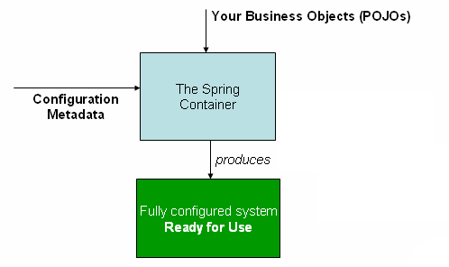

<br/>
<br/>

# Spring IoC 컨테이너와 ApplicationContext - Container Overview

## Spring IoC 컨테이너 역할  
**Spring IoC(제어의 역전) 컨테이너**는 애플리케이션의 객체들을 관리하는 핵심 구성 요소이다.  

**주요 역할**
- **Bean 생성**: 애플리케이션에서 사용할 객체(Bean)를 생성한다.
- **Bean 설정**: 생성된 Bean의 초기화 및 설정을 수행한다.
- **Bean 연결**: 서로 의존하는 Bean 간의 연결을 관리한다.  

Spring IoC 컨테이너는 다양한 **구성 정보**를 읽어와 어떤 컴포넌트를 어떻게 만들고 설정할지에 대한 방법을 제공한다.

<br/>

## 구성 정보의 종류
Spring IoC 컨테이너는 다음과 같은 다양한 방법으로 구성 정보를 읽어들일 수 있다.
- **Annotation(주석)이 붙은 클래스**: `@Component`, `@Service`, `@Repository` 등의 애너테이션을 통해 Bean을 정의한다.
- **팩토리 메서드가 포함된 설정 클래스**: `@Configuration` 애너테이션을 사용하여 Bean을 생성하는 메서드를 정의한다.
- **외부 XML 파일**: 전통적인 방식으로 XML 파일에 Bean의 정의를 포함한다.
- **Groovy 스크립트**: Groovy 언어를 사용한 동적인 Bean 설정을 지원한다.

이러한 구성 요소들 간의 다양한 의존성을 통해 애플리케이션을 구성할 수 있다.  

<br/>

## ApplicationContext 인터페이스
**ApplicationContext**는 Spring IoC 컨테이너의 핵심 인터페이스로, 여러 구현체를 통해 애플리케이션의 다양한 요구를 충족한다.   

**주요 구현체**
- **AnnotationConfigApplicationContext**: 주석 기반의 설정을 사용하는 경우.
- **ClassPathXmlApplicationContext**: XML 파일을 기반으로 설정을 사용하는 경우.

<br/>

### 인스턴스 생성하기
대부분의 애플리케이션에서는 Spring IoC 컨테이너의 인스턴스를 사용자 코드로 직접 생성할 필요가 없다. 일반적인 웹 애플리케이션에서는 **web.xml** 파일에 간단한 보일러 플레이트 웹 설명자 XML만으로 충분하며, Spring Boot에서는 일반적인 설정에 따라 애플리케이션 컨텍스트가 암묵적으로 부트스트랩된다. 이로 인해 개발자는 설정에 대한 부담 없이 빠르게 애플리케이션을 개발할 수 있다.

<br/>

## Spring의 작동 방식
다음 다이어그램은 Spring의 작동 방식을 높은 수준에서 보여준다. 애플리케이션 클래스는 구성 메타데이터와 결합되어 **ApplicationContext**가 생성되고 초기화된 후에야 실행 가능한 시스템이나 애플리케이션을 갖추게 된다.  
  

<br/>

## 요점 정리
- **Spring IoC 컨테이너**: Bean 생성, 설정, 연결을 관리.
- **구성 정보**: Annotation, XML, Groovy 등 다양한 형식 지원.
- **ApplicationContext**: IoC 컨테이너의 핵심 인터페이스, 여러 구현체 존재.
- **Spring Boot**: 설정 없이 자동으로 `ApplicationContext` 부트스트랩.

<br/>
* * *
<br/>

# 구성 메타데이터와 Spring IoC 컨테이너
Spring IoC(제어의 역전) 컨테이너는 개발자가 정의한 구성 메타데이터를 소비하여 애플리케이션의 컴포넌트를 관리한다. 

<br/>

## 구성 메타데이터란?
구성 메타데이터는 Spring 컨테이너에 애플리케이션의 구성 요소를 다음과 같이 지시하는 방법이다.  
- **컴포넌트 인스턴스화**: 애플리케이션에서 사용할 객체(Bean)를 생성하는 방법을 정의한다.
- **컴포넌트 구성**: 생성된 객체의 속성을 설정하는 방법을 명시한다.
- **컴포넌트 조합**: 서로 다른 컴포넌트 간의 의존성을 관리하고 연결하는 방법을 설명한다.  
Spring IoC 컨테이너는 이러한 구성 메타데이터가 어떤 형식으로 작성되든 상관없이 동일한 방식으로 작동한다. 즉, 개발자는 구성 정보를 Annotation(주석), XML 파일 또는 다른 여러 형식으로 작성할 수 있으며, Spring 컨테이너는 이러한 형식에 의존하지 않고 작동한다. 이는 비결합성(Loose Coupling)을 가능하게 한다.

<br/>

## 자바 기반의 Spring 애플리케이션 구성
Spring 애플리케이션의 구성 방식은 주로 두 가지로 나눌 수 있다.
1. **Annotation-based configuration (주석 기반 구성)**: 
   - 애플리케이션의 컴포넌트 클래스에서 Annotation을 사용하여 Bean을 정의한다.
   - 예를 들어, `@Component`, `@Service`, `@Repository` 등의 애너테이션을 사용한다.  
2. **Java-based configuration (자바 기반 구성)**: 
   - 자바 기반의 구성 클래스를 사용하여 애플리케이션 클래스 외부에 Bean을 정의한다.
   - 이러한 기능을 사용하려면 [**`@Configuration`**](https://docs.spring.io/spring-framework/docs/6.1.13/javadoc-api/org/springframework/context/annotation/Configuration.html), [**`@Bean`**](https://docs.spring.io/spring-framework/docs/6.1.13/javadoc-api/org/springframework/context/annotation/Bean.html), [**`@Import`**](https://docs.spring.io/spring-framework/docs/6.1.13/javadoc-api/org/springframework/context/annotation/Import.html), [**`@DependsOn`**](https://docs.spring.io/spring-framework/docs/6.1.13/javadoc-api/org/springframework/context/annotation/DependsOn.html) 애너테이션을 참고해야 한다.  

<br/>

### Bean 정의
Spring 구성은 컨테이너가 관리해야 하는 하나 이상의 Bean 정의로 구성된다. 자바 구성의 경우, 일반적으로 **`@Configuration`** 클래스 내에서 **`@Bean`** 애너테이션을 달고 있는 메서드를 사용하여 Bean을 정의한다. 각 메서드는 하나의 Bean 정의에 해당한다.  
Bean 정의는 애플리케이션을 구성하는 실제 객체에 해당하며, 일반적으로 다음과 같은 객체를 정의한다.  
- 서비스 계층 객체
- 저장소나 데이터 접근 객체(DAO)와 같은 지속성 계층 객체
- 웹 컨트롤러와 같은 프레젠테이션 객체
- JPA **`EntityManagerFactory`**와 같은 인프라스트럭처 객체
- JMS 큐  
일반적으로 세밀한 도메인 객체는 컨테이너에서 구성하지 않는다. 이는 도메인 객체의 생성 및 로드가 보통 저장소와 비즈니스 로직의 책임이기 때문이다.  

<br/>

## 요점 정리
- **구성 메타데이터**: 애플리케이션의 컴포넌트 인스턴스화, 구성, 조합에 대한 지시.
- **비결합성**: 구성 형식에 의존하지 않고 동일한 방식으로 작동.
- **구성 방식**:
  - `Annotation-based configuration`: 주석을 통한 Bean 정의.
  - `Java-based configuration`: 자바 클래스 외부에서 Bean 정의.
- **Bean 정의**: 애플리케이션의 실제 객체를 정의하며, 일반적으로 서비스, DAO, 컨트롤러 객체를 포함.  

<br/>
* * *
<br/>

# 외부 구성 DSL로서의 XML
Spring IoC 컨테이너는 XML 기반의 구성 메타데이터를 사용하여 애플리케이션의 Bean을 정의하고 관리한다. XML은 외부 구성 DSL(Data Specification Language)로서, 개발자가 설정 정보를 명확하게 표현할 수 있는 방법을 제공한다.  

<br/>

## XML 기반의 Bean 정의 예시
기본적인 XML 기반의 구성 메타데이터 예시  
```xml
<?xml version="1.0" encoding="UTF-8"?>
<beans xmlns="http://www.springframework.org/schema/beans"
       xmlns:xsi="http://www.w3.org/2001/XMLSchema-instance"
       xsi:schemaLocation="http://www.springframework.org/schema/beans
                           https://www.springframework.org/schema/beans/spring-beans.xsd">

    <bean id="..." class="...">
        <!-- collaborators and configuration for this bean go here -->
    </bean>

    <bean id="..." class="...">
        <!-- collaborators and configuration for this bean go here -->
    </bean>

    <!-- more bean definitions go here -->
</beans>
```

<br/>

### 주요 속성 설명
1. **`id`** 속성: 개별 Bean 정의를 식별하는 문자열이다.
2. **`class`** 속성: Bean의 타입을 정의하며, 완전한 클래스 이름을 사용한다.  

이 **`id`** 값은 협력 객체를 참조하는 데 사용될 수 있다. 협력 객체를 참조하는 XML은 예제에 포함되어 있지 않지만, 더 많은 정보는 [Dependencies](https://docs.spring.io/spring-framework/reference/core/beans/dependencies.html)를 참조하면 된다고 한다.  

<br/>

## 컨테이너 인스턴스화 방법
XML 리소스 파일의 위치 경로를 **`ClassPathXmlApplicationContext`** 생성자에 공급하여 컨테이너를 인스턴스화할 수 있다. 이를 통해 컨테이너는 로컬 파일 시스템, 자바 **`CLASSPATH`** 등 다양한 외부 리소스에서 구성 메타데이터를 로드할 수 있다.  

<br/>

## 서비스 계층 객체 구성 파일 예시
아래는 서비스 계층 객체를 정의한 XML 파일 예시이다 (**`services.xml`**).  
```xml
<?xml version="1.0" encoding="UTF-8"?>
<beans xmlns="http://www.springframework.org/schema/beans"
       xmlns:xsi="http://www.w3.org/2001/XMLSchema-instance"
       xsi:schemaLocation="http://www.springframework.org/schema/beans
                           https://www.springframework.org/schema/beans/spring-beans.xsd">

    <bean id="petStore" class="org.springframework.samples.jpetstore.services.PetStoreServiceImpl">
        <property name="accountDao" ref="accountDao"/>
        <property name="itemDao" ref="itemDao"/>
        <!-- 이 Bean에 대한 추가 협력자 및 구성은 여기에서 설정한다. -->
    </bean>

    <!-- 서비스에 대한 더 많은 Bean 정의는 여기에서 설정한다. -->

</beans>
```

<br/>

## 데이터 액세스 객체 구성 파일 예시
아래는 데이터 액세스 객체를 정의한 XML 파일 예시 (**`daos.xml`**).  
```xml
<?xml version="1.0" encoding="UTF-8"?>
<beans xmlns="http://www.springframework.org/schema/beans"
       xmlns:xsi="http://www.w3.org/2001/XMLSchema-instance"
       xsi:schemaLocation="http://www.springframework.org/schema/beans
                           https://www.springframework.org/schema/beans/spring-beans.xsd">

    <bean id="accountDao" class="org.springframework.samples.jpetstore.dao.jpa.JpaAccountDao">
        <!-- 이 Bean에 대한 추가 협력자 및 구성은 여기에서 설정한다. -->
    </bean>

    <bean id="itemDao" class="org.springframework.samples.jpetstore.dao.jpa.JpaItemDao">
        <!-- 이 Bean에 대한 추가 협력자 및 구성은 여기에서 설정한다. -->
    </bean>

    <!-- 데이터 액세스 객체에 대한 더 많은 Bean 정의는 여기에서 설정한다. -->
</beans>
```

<br/>

## 의존성 주입
이전 예제에서는 서비스 계층이 `PetStoreServiceImpl` 클래스와 두 개의 데이터 액세스 객체인 `JpaAccountDao` 및 `JpaItemDao`로 구성되어 있다.   
- **속성 요소**: JavaBean에서 사용하는 속성의 이름을 나타내며, 클래스의 필드를 참조한다.
- **참조 요소**: 다른 Bean 정의의 이름을 나타내며, 특정 Bean을 참조할 때 사용된다.  
ID 요소와 참조 요소 간의 연결은 협업하는 객체 간의 종속성을 표현한다. 즉, 서비스 계층의 `PetStoreServiceImpl` 클래스가 `JpaAccountDao`와 `JpaItemDao`를 필요로 할 때, 이 두 객체는 서로 협력하여 데이터에 접근하고 처리한다. 이러한 종속성 관계는 애플리케이션의 구조를 명확하게 이해하는 데 도와준다.    

<br/>

## 요점 정리
- **XML 기반의 구성 메타데이터**: Bean 정의 및 의존성 관계를 명시하는 데 사용된다.
- **Bean 정의 예시**: `id`와 `class` 속성을 통해 개별 Bean을 정의한다.
- **의존성 주입**: 속성 요소와 참조 요소를 통해 협력 객체 간의 관계를 설정한다.
- **리소스 경로**: XML 파일을 통해 Bean 정의를 로드하고 컨테이너를 인스턴스화한다.  

<br/>
* * *
<br/>

# XML 기반 구성 메타데이터 구성
Spring IoC 컨테이너는 XML 기반의 Bean 정의를 통해 애플리케이션의 구성 메타데이터를 제공한다. 이러한 Bean 정의는 여러 개의 XML 파일에 나누어 적용할 수 있으며, 이는 여러 가지 장점을 제공한다.  

<br/>

## XML 파일의 장점
### 1. 논리적 계층
애플리케이션은 일반적으로 여러 계층으로 구성된다. 예를 들어, 프레젠테이션 계층, 서비스 계층, 데이터 접근 계층 등이 있다. 각 계층에 대한 Bean 정의를 별도의 XML 파일에 나누어 정의하면, 각 계층의 구성 정보를 독립적으로 관리할 수 있다. 이는 유지보수성과 가독성을 높이는 데 기여한다.  

<br/>

### 2. 모듈화
애플리케이션이 여러 모듈로 나뉘어 있는 경우, 각 모듈에 대해 별도의 XML 파일을 사용하여 Bean 정의를 관리하면 모듈 간의 독립성을 유지할 수 있다. 이를 통해 각 모듈의 변경이 다른 모듈에 미치는 영향을 최소화할 수 있다.  

<br/>

## Bean 정의 로드 방법
**`ClassPathXmlApplicationContext`** 생성자를 사용하면 XML 조각에서 Bean 정의를 로드할 수 있다. 이 생성자는 여러 **`Resource`** 위치를 가져올 수 있으며, 이를 통해 각기 다른 XML 파일에 정의된 Bean들을 동시에 사용할 수 있다.  

<br/>

### XML 조각 및 리소스 위치
Bean 정의는 XML 파일 내에서 정의되며, 이러한 정의를 통해 애플리케이션의 컴포넌트들을 설정하고 관리한다. 다음과 같은 방식으로 여러 XML 파일을 통합할 수 있다.  
```xml
<beans>
    <import resource="services.xml"/>
    <import resource="resources/messageSource.xml"/>
    <import resource="/resources/themeSource.xml"/>

    <bean id="bean1" class="..."/>
    <bean id="bean2" class="..."/>
</beans>
```  
위 예제에서는 외부 Bean 정의가 세 개의 파일 (**`services.xml`**, **`messageSource.xml`**, **`themeSource.xml`**)에서 로드됩니다. 모든 위치 경로는 현재 **import**를 선언한 파일과 상대적이므로, **`services.xml`**은 **import**를 수행하는 파일과 동일한 디렉토리 또는 클래스 경로 위치에 있어야 한다.  

<br/>

## 경로 및 네임스페이스 관리
### 상대 경로 사용 주의
상대적인 "..../" 경로를 사용하여 상위 디렉토리에 있는 파일을 참조하는 것은 가능하지만, 일반적으로 권장되지 않는다. 이렇게 하면 현재 애플리케이션의 외부에 있는 파일에 의존하게 되므로, 파일이 이동하거나 삭제되면 애플리케이션이 정상적으로 작동하지 않을 수 있다.  
특히, 클래스패스에서 상대 경로를 사용하는 것은 위험할 수 있다. 클래스패스의 URL(예: `classpath:..../services.xml`)을 사용하면 런타임 시 "가장 가까운" 클래스패스 루트를 선택하고, 그 루트에서 상위 디렉토리로 올라가서 파일을 찾게 된다.  

<br/>

### 절대 경로 사용 권장
상대 경로 대신에 정규화된 리소스 위치를 사용하는 것이 좋다. 예를 들어, 파일 시스템의 절대 경로를 사용하여 `file:C:/config/services.xml` 또는 클래스패스의 절대 경로인 `classpath:/config/services.xml`과 같은 방식으로 파일을 참조할 수 있다. 이러한 방법은 경로가 명확하고, 파일의 위치를 정확하게 지정할 수 있기 때문에 안정적이다.

<br/>

### 동적 경로 관리
절대 위치를 사용하는 경우, 애플리케이션의 구성이 특정한 위치에 고정된다는 점에 유의해야 한다. 파일의 위치가 변경되면 애플리케이션이 정상적으로 작동하지 않을 수 있다. 이러한 문제를 피하기 위해 일반적으로 실행 시 JVM 시스템 속성에 따라 해결되는 `${....}` 플레이스홀더를 사용하는 것이 좋다. 예를 들어, `${config.dir}/services.xml`과 같이 설정하면, `config.dir`이라는 시스템 속성에 따라 파일의 경로를 동적으로 설정할 수 있다.  

<br/>

## XML 네임스페이스
네임스페이스는 가져오기 지시 기능을 제공한다. 일반 Bean 정의를 넘어서는 추가 구성 기능은 Spring에서 제공하는 일부 XML 네임스페이스, 예를 들어 **`context`** 및 **`util`** 네임스페이스를 통해 사용할 수 있다.  

<br/>

## 요점 정리
- **XML 기반 구성 메타데이터**: Bean 정의와 의존성 관계를 명시하는 데 사용된다.
- **논리적 계층 및 모듈화**: 각 계층이나 모듈에 대해 별도의 XML 파일을 사용하여 독립성을 유지한다.
- **Bean 정의 로드**: `ClassPathXmlApplicationContext` 생성자를 사용하여 여러 XML 파일에서 Bean 정의를 로드할 수 있다.
- **상대 경로 사용 주의**: 상대 경로 대신 절대 경로 및 동적 경로 관리를 통해 안정성을 높인다.
- **XML 네임스페이스**: Spring의 추가 구성 기능을 제공하여 유연성을 높인다.  

<br/>
* * *
<br/>

# Groovy Bean 정의 DSL
Spring IoC 컨테이너는 외부화된 구성 메타데이터를 Groovy Bean 정의 DSL로 표현할 수 있다. 이 DSL은 Grails 프레임워크에서 주로 사용되며, 코드와 설정을 간결하고 읽기 쉽게 작성할 수 있는 장점을 제공한다.  

<br/>

## Groovy Bean 정의 예시
Groovy Bean 정의는 **`.groovy`** 파일에서 다음과 같은 구조로 사용된다.  
```groovy
beans {
    dataSource(BasicDataSource) {
        driverClassName = "org.hsqldb.jdbcDriver"
        url = "jdbc:hsqldb:mem:grailsDB"
        username = "sa"
        password = ""
        settings = [mynew: "setting"]
    }
    sessionFactory(SessionFactory) {
        dataSource = dataSource
    }
    myService(MyService) {
        nestedBean = { AnotherBean bean ->
            dataSource = dataSource
        }
    }
}
```

<br/>

### 구성 요소 설명
- **`beans`**: Groovy DSL의 최상위 요소로, Bean 정의를 포함한다.
- **`dataSource`**: `BasicDataSource` 클래스의 인스턴스를 생성하며, 필요한 속성을 설정한다.
- **`sessionFactory`**: `SessionFactory` 인스턴스를 생성하고, `dataSource`를 참조하여 의존성을 주입한다.
- **`myService`**: 사용자 정의 서비스 클래스를 정의하고, 그 안에 중첩된 Bean을 설정한다.  
이 구성 스타일은 XML Bean 정의와 유사하며, Spring의 XML 구성 네임스페이스도 지원한다. 

<br/>

### XML Bean 정의 가져오기
Groovy DSL에서는 **`ImportBeans`** 디렉티브를 통해 XML Bean 정의 파일을 가져올 수 있다. 이를 통해 기존 XML 기반의 Bean 정의와 Groovy DSL을 혼합하여 사용할 수 있다.  

<br/>

## 요점 정리
- **Groovy Bean 정의 DSL**: Spring IoC 컨테이너의 외부화된 구성 메타데이터를 간결하게 표현하는 방법.
- **구성 구조**: Groovy DSL은 XML과 유사하며, 읽기 쉽고 유지보수가 용이함.
- **네임스페이스 지원**: Spring의 XML 구성 네임스페이스를 지원하여 기존 XML 정의와 호환 가능.
- **ImportBeans 디렉티브**: XML Bean 정의 파일을 Groovy DSL로 가져와 혼합하여 사용할 수 있음.  

<br/>
* * *
<br/>

# Spring IoC 컨테이너 사용
**`ApplicationContext`**는 다양한 Bean과 그 의존 관계의 레지스트리를 관리할 수 있는 고급 팩토리 인터페이스이다. 이 인터페이스를 통해 애플리케이션의 Bean을 손쉽게 검색하고 사용할 수 있다.  

<br/>

## Bean 검색 방법
**`getBean(String name, Class<T> requiredType)`** 메서드를 사용하면 특정 이름과 타입에 해당하는 Bean의 인스턴스를 검색할 수 있다. 다음은 XML 파일을 통해 Bean을 구성하고 검색하는 예시이다.  
```java
// create and configure beans
ApplicationContext context = new ClassPathXmlApplicationContext("services.xml", "daos.xml");

// retrieve configured instance
PetStoreService service = context.getBean("petStore", PetStoreService.class);

// use configured instance
List<String> userList = service.getUsernameList();
```  

<br/>

## Groovy를 통한 구성
Groovy 구성에서도 부트스트래핑(애플리케이션 초기화 과정)은 매우 유사하게 진행된다. Spring은 Groovy를 인식하는 여러 다른 컨텍스트 구현 클래스를 제공하며, 이들 또한 XML Bean 정의를 이해한다. Groovy를 이용한 구성은 코드의 간결함과 유연성을 제공하여 개발자가 더 직관적으로 Bean을 설정할 수 있도록 도와준다.  
```java
ApplicationContext context = new GenericGroovyApplicationContext("services.groovy", "daos.groovy");
```  

## GenericApplicationContext와 리더 위임자
Spring에서는 가장 유연한 구성 방식으로 **`GenericApplicationContext`**와 **리더 위임자**를 결합하여 사용할 수 있다. 이 조합은 다양한 형식의 Bean 정의를 읽고 처리할 수 있는 기능을 제공한다.  
예를 들어, XML 파일을 처리하기 위해 **`XmlBeanDefinitionReader`**를 사용할 수 있다. 이 리더는 XML 형식의 Bean 정의를 읽어서 **`GenericApplicationContext`**에 등록하는 역할을 한다.  
```java
GenericApplicationContext context = new GenericApplicationContext();
new XmlBeanDefinitionReader(context).loadBeanDefinitions("services.xml", "daos.xml");
context.refresh();
```  

동일한 **`ApplicationContext`**에서 이러한 리더 위임을 혼합하여 다양한 구성 소스에서 Bean 정의를 읽을 수 있다. Groovy 파일에 대해서는 **`GroovyBeanDefinitionReader`**를 사용할 수 있다.  
```java
GenericApplicationContext context = new GenericApplicationContext();
new GroovyBeanDefinitionReader(context).loadBeanDefinitions("services.groovy", "daos.groovy");
context.refresh();
```  

<br/>

## 의존성 주입과 코드 독립성
**`getBean`** 메서드를 사용하면 애플리케이션에서 Bean 인스턴스를 가져올 수 있다. 그러나 **`ApplicationContext`** 인터페이스에는 Bean을 가져오는 다른 메서드들도 있지만, 애플리케이션 코드에서는 이러한 메서드를 사용하지 않는 것이 좋다. 실제로 애플리케이션 코드에는 **`getBean()`** 메서드를 호출하는 부분이 없어야 하며, 따라서 Spring API에 의존해서는 안된다.  

<br/>

### 이유
1. **의존성 분리**: 애플리케이션 코드가 Spring API에 의존하지 않으면, 코드의 독립성을 높일 수 있다. 이렇게 하면 다른 프레임워크로 쉽게 전환하거나 테스트하기가 수월해진다.
2. **메타데이터 활용**: Spring은 웹 프레임워크와 통합되어, 컨트롤러나 JSF 관리 Bean과 같은 다양한 컴포넌트에 대해 의존성을 주입할 수 있다. 이때, 메타데이터(예: 자동 주입 주석)를 사용하여 특정 에 대한 의존성을 선언할 수 있다. 즉, 필요한 Bean을 코드에서 직접 요청하는 대신, Spring이 자동으로 주입해 주는 방식이다.  

<br/>

## 요점 정리
- **ApplicationContext**: Bean과 의존 관계를 관리하는 고급 팩토리 인터페이스.
- **Bean 검색**: `getBean` 메서드를 통해 특정 Bean 인스턴스를 검색.
- **Groovy 구성**: Groovy를 사용하여 Bean을 정의하고 구성할 수 있으며, XML과 유사한 방식으로 진행.
- **GenericApplicationContext**: 다양한 형식의 Bean 정의를 읽고 처리할 수 있는 유연한 구조.
- **의존성 주입**: Spring의 자동 주입 기능을 활용하여 애플리케이션 코드에서 Spring API에 대한 의존성을 줄이는 것이 바람직.  

<br/>
<br/>
<br/>
* * *
<br/>
<br/>
<br/>

> **Reference**  
<a href="https://docs.spring.io/spring-framework/reference/core/beans/basics.html" style="text-decoration: none; color: #757575;">Container Overview</a>